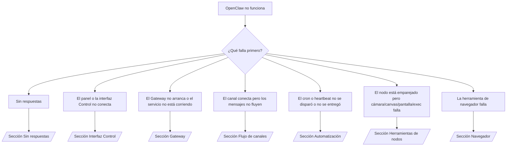

# Solución de problemas

Si solo tienes 2 minutos, usa esta página como punto de entrada para el diagnóstico.

## Los primeros 60 segundos

Ejecuta esta escalera exacta en orden:

```bash
openclaw status
openclaw status --all
openclaw gateway probe
openclaw gateway status
openclaw doctor
openclaw channels status --probe
openclaw logs --follow
```

Buena salida en una línea:

- `openclaw status` → muestra los canales configurados y ningún error de autenticación obvio.
- `openclaw status --all` → el reporte completo está presente y se puede compartir.
- `openclaw gateway probe` → el objetivo esperado del gateway es alcanzable.
- `openclaw gateway status` → `Runtime: running` y `RPC probe: ok`.
- `openclaw doctor` → sin errores bloqueantes de configuración/servicio.
- `openclaw channels status --probe` → los canales reportan `connected` o `ready`.
- `openclaw logs --follow` → actividad constante, sin errores fatales repetitivos.

## Árbol de decisiones



<AccordionGroup>
  <Accordion title="Sin respuestas">
    ```bash
    openclaw status
    openclaw gateway status
    openclaw channels status --probe
    openclaw pairing list --channel <channel> [--account <id>]
    openclaw logs --follow
    ```

    Una buena salida se ve así:

    - `Runtime: running`
    - `RPC probe: ok`
    - Tu canal aparece como connected/ready en `channels status --probe`
    - El remitente aparece aprobado (o la política de mensajes directos es open/allowlist)

    Firmas comunes en los logs:

    - `drop guild message (mention required` → el filtro de menciones bloqueó el mensaje en Discord.
    - `pairing request` → el remitente no está aprobado y espera la aprobación de emparejamiento.
    - `blocked` / `allowlist` en los logs del canal → el remitente, sala o grupo está filtrado.

    Páginas detalladas:

    - [/gateway/troubleshooting#no-replies](/gateway/troubleshooting#no-replies)
    - [/channels/troubleshooting](/channels/troubleshooting)
    - [/channels/pairing](/channels/pairing)

  </Accordion>

  <Accordion title="El panel o la interfaz Control no conecta">
    ```bash
    openclaw status
    openclaw gateway status
    openclaw logs --follow
    openclaw doctor
    openclaw channels status --probe
    ```

    Una buena salida se ve así:

    - `Dashboard: http://...` se muestra en `openclaw gateway status`
    - `RPC probe: ok`
    - Sin bucle de autenticación en los logs

    Firmas comunes en los logs:

    - `device identity required` → el contexto HTTP/no seguro no puede completar la autenticación del dispositivo.
    - `unauthorized` / bucle de reconexión → token/contraseña incorrectos o modo de autenticación no coincide.
    - `gateway connect failed:` → la interfaz apunta a la URL/puerto incorrecto o el gateway es inalcanzable.

    Páginas detalladas:

    - [/gateway/troubleshooting#dashboard-control-ui-connectivity](/gateway/troubleshooting#dashboard-control-ui-connectivity)
    - [/web/control-ui](/web/control-ui)
    - [/gateway/authentication](/gateway/authentication)

  </Accordion>

  <Accordion title="El Gateway no arranca o el servicio está instalado pero no corre">
    ```bash
    openclaw status
    openclaw gateway status
    openclaw logs --follow
    openclaw doctor
    openclaw channels status --probe
    ```

    Una buena salida se ve así:

    - `Service: ... (loaded)`
    - `Runtime: running`
    - `RPC probe: ok`

    Firmas comunes en los logs:

    - `Gateway start blocked: set gateway.mode=local` → el modo del gateway no está establecido/es remoto.
    - `refusing to bind gateway ... without auth` → bind no-loopback sin token/contraseña.
    - `another gateway instance is already listening` o `EADDRINUSE` → el puerto ya está ocupado.

    Páginas detalladas:

    - [/gateway/troubleshooting#gateway-service-not-running](/gateway/troubleshooting#gateway-service-not-running)
    - [/gateway/background-process](/gateway/background-process)
    - [/gateway/configuration](/gateway/configuration)

  </Accordion>

  <Accordion title="El canal conecta pero los mensajes no fluyen">
    ```bash
    openclaw status
    openclaw gateway status
    openclaw logs --follow
    openclaw doctor
    openclaw channels status --probe
    ```

    Una buena salida se ve así:

    - El transporte del canal está conectado.
    - Las verificaciones de emparejamiento/lista de permitidos pasan.
    - Las menciones se detectan donde son requeridas.

    Firmas comunes en los logs:

    - `mention required` → el filtro de menciones en grupo bloqueó el procesamiento.
    - `pairing` / `pending` → el remitente del mensaje directo aún no está aprobado.
    - `not_in_channel`, `missing_scope`, `Forbidden`, `401/403` → problema con el token de permisos del canal.

    Páginas detalladas:

    - [/gateway/troubleshooting#channel-connected-messages-not-flowing](/gateway/troubleshooting#channel-connected-messages-not-flowing)
    - [/channels/troubleshooting](/channels/troubleshooting)

  </Accordion>

  <Accordion title="El cron o heartbeat no se disparó o no se entregó">
    ```bash
    openclaw status
    openclaw gateway status
    openclaw cron status
    openclaw cron list
    openclaw cron runs --id <jobId> --limit 20
    openclaw logs --follow
    ```

    Una buena salida se ve así:

    - `cron.status` muestra habilitado con un próximo despertar.
    - `cron runs` muestra entradas recientes con `ok`.
    - El heartbeat está habilitado y no está fuera del horario activo.

    Firmas comunes en los logs:

    - `cron: scheduler disabled; jobs will not run automatically` → el cron está deshabilitado.
    - `heartbeat skipped` con `reason=quiet-hours` → fuera del horario activo configurado.
    - `requests-in-flight` → carril principal ocupado; el despertar del heartbeat fue diferido.
    - `unknown accountId` → la cuenta objetivo de entrega del heartbeat no existe.

    Páginas detalladas:

    - [/gateway/troubleshooting#cron-and-heartbeat-delivery](/gateway/troubleshooting#cron-and-heartbeat-delivery)
    - [/automation/troubleshooting](/automation/troubleshooting)
    - [/gateway/heartbeat](/gateway/heartbeat)

  </Accordion>

  <Accordion title="El nodo está emparejado pero la herramienta falla (cámara/canvas/pantalla/exec)">
    ```bash
    openclaw status
    openclaw gateway status
    openclaw nodes status
    openclaw nodes describe --node <idOrNameOrIp>
    openclaw logs --follow
    ```

    Una buena salida se ve así:

    - El nodo aparece como conectado y emparejado para el rol `node`.
    - La capacidad existe para el comando que estás invocando.
    - El estado de permiso está otorgado para la herramienta.

    Firmas comunes en los logs:

    - `NODE_BACKGROUND_UNAVAILABLE` → trae la app del nodo al primer plano.
    - `*_PERMISSION_REQUIRED` → el permiso del SO fue denegado/falta.
    - `SYSTEM_RUN_DENIED: approval required` → la aprobación de ejecución está pendiente.
    - `SYSTEM_RUN_DENIED: allowlist miss` → el comando no está en la lista de ejecución permitida.

    Páginas detalladas:

    - [/gateway/troubleshooting#node-paired-tool-fails](/gateway/troubleshooting#node-paired-tool-fails)
    - [/nodes/troubleshooting](/nodes/troubleshooting)
    - [/tools/exec-approvals](/tools/exec-approvals)

  </Accordion>

  <Accordion title="La herramienta de navegador falla">
    ```bash
    openclaw status
    openclaw gateway status
    openclaw browser status
    openclaw logs --follow
    openclaw doctor
    ```

    Una buena salida se ve así:

    - El estado del navegador muestra `running: true` y un navegador/perfil elegido.
    - El perfil `openclaw` arranca o el relay de `chrome` tiene una pestaña conectada.

    Firmas comunes en los logs:

    - `Failed to start Chrome CDP on port` → el lanzamiento del navegador local falló.
    - `browser.executablePath not found` → la ruta del binario configurada es incorrecta.
    - `Chrome extension relay is running, but no tab is connected` → la extensión no está conectada.
    - `Browser attachOnly is enabled ... not reachable` → el perfil attach-only no tiene un objetivo CDP activo.

    Páginas detalladas:

    - [/gateway/troubleshooting#browser-tool-fails](/gateway/troubleshooting#browser-tool-fails)
    - [/tools/browser-linux-troubleshooting](/tools/browser-linux-troubleshooting)
    - [/tools/chrome-extension](/tools/chrome-extension)

  </Accordion>
</AccordionGroup>
